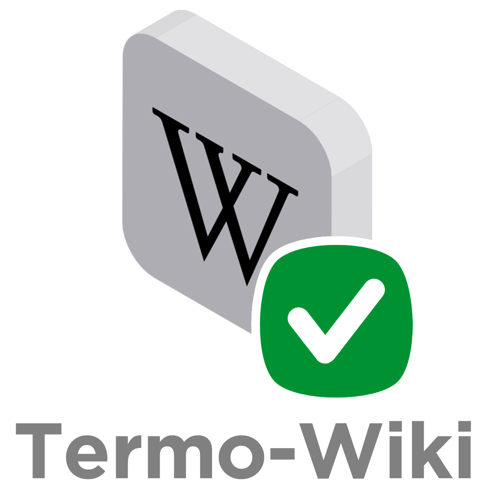

<!-----

Yay, no errors, warnings, or alerts!

Conversion time: 0.377 seconds.

Using this Markdown file:

1. Paste this output into your source file.
2. See the notes and action items below regarding this conversion run.
3. Check the rendered output (headings, lists, code blocks, tables) for proper
   formatting and use a linkchecker before you publish this page.

Conversion notes:

* Docs to Markdown version 1.0β33
* Tue Sep 20 2022 09:18:49 GMT-0700 (PDT)
* Source doc: Textos complementares
----->

**Termo-Wiki - Termômetro de confiabilidade da Wikipédia**

A Termo-Wiki é uma extensão para navegadores que coleta informações indicadoras de tendências de confiabilidade em artigos da Wikipédia.

Embora objetive ser uma grande enciclopédia de conhecimentos, a Wikipédia se cerca de desconfiança em meio à comunidade científica quanto à sua confiabilidade. Pesquisas acadêmicas indicam, porém, que a plataforma é extensamente utilizada para consulta por estudantes da educação básica e de graduação.

Diante disso, cientistas sinalizam que desaconselhar seu uso não configura a opção mais recomendada – melhor seria instruir estudantes a como identificar padrões de confiabilidade no conteúdo. Embora não perceptíveis de imediato, muitos desses padrões já são medidos pela própria Wikipédia e seus resultados são públicos. 

A Termo-Wiki nasceu com o propósito de preencher essa lacuna. O desenvolvimento da extensão aconteceu no contexto da _[No-Budget Science Hack Week 2022](https://www.reprodutibilidade.bio.br/no-budget-science-hack-week-2022)_, um hackathon de metaciência - ciência para fazer melhor ciência -, coordenado pelo Prof. Olavo Amaral da Universidade Federal do Rio de Janeiro (UFRJ), sob apoio do Instituto Serrapilheira e da Universidade de São Paulo (USP). 

Essa iniciativa seleciona pesquisadores(as) de diversas partes do Brasil que, ao longo de uma semana, se dedicam à concepção de projetos inovadores. A equipe que idealizou a Termo-Wiki é composta por Felipe Argolo, João Gabriel de Paula, Juliane Bazzo, Lisiane Müller, Núbia Marques e Tiago Lubiana.

A extensão é acompanhada por uma cartilha educativa, que orienta sobre como a extensão funciona e vai além: revela o processo pelo qual foi construída, que configura a própria forma de a Wikipédia captar indicativos de confiabilidade em seu conteúdo. 

Baixe aqui a **extensão** Termo-Wiki para instalação local \
 [([https://github.com/fargolo/TermoWiki/archive/refs/heads/main.zip](https://github.com/fargolo/TermoWiki/archive/refs/heads/main.zip))] \
Atualmente, a extensão está sob análise para publicação na Google Store.

[Baixe aqui a** cartilha** Termo-Wiki](./cartilha.md)

**CARTILHA - PASSO A PASSO PARA BAIXAR A EXTENSÃO?**

Confira o passo a passo para baixar a Termo-Wiki em seu dispositivo:

Tutorial sobre instalação de extensão local:  \
[[https://canaltech.com.br/navegadores/como-instalar-extensao-no-google-chrome-manualmente/](https://canaltech.com.br/navegadores/como-instalar-extensao-no-google-chrome-manualmente/)]
