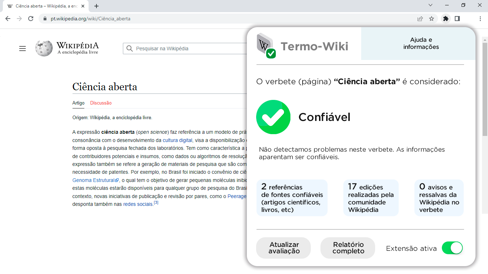
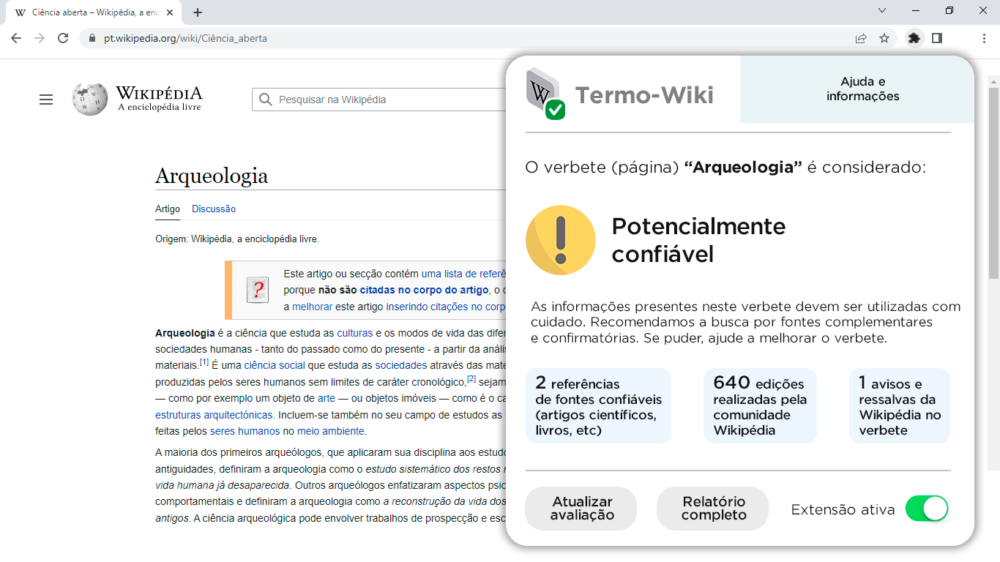
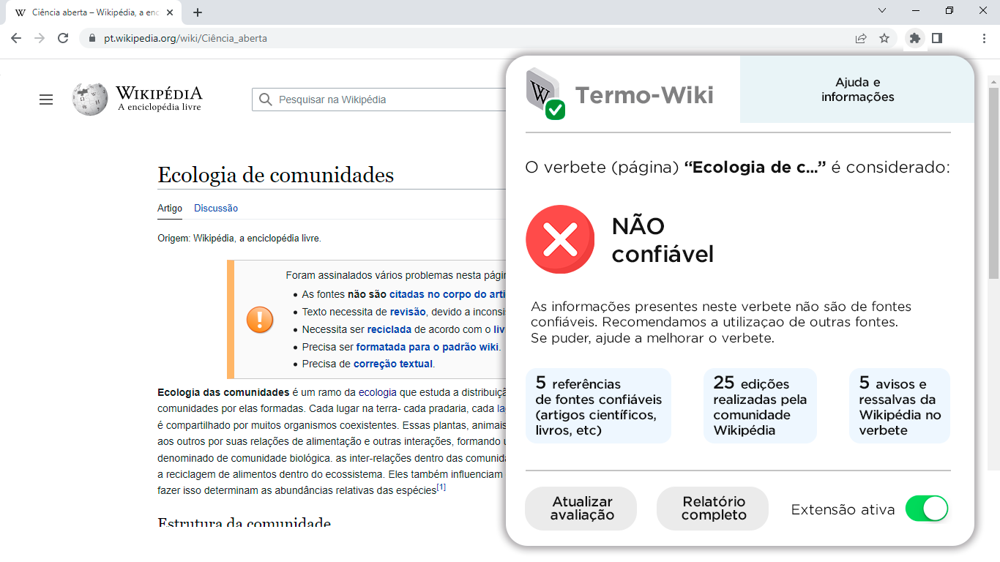

## TermoWiki

**TermoWiki - Termômetro de confiabilidade da Wikipédia**

**Autores:** Felipe Argolo, João Gabriel de Paula, Julliane Bazzo, Nubia Marques, Lisiane Müller, Tiago Lubiana

**Apresentação:**

Este projeto descreve a criação de uma extensão para navegador web.

Esta ferramenta pretende facilitar o acesso à informações de qualidade dentro da plataforma da Wikipédia, permitindo que o usuário, com um clique, verifique se as informações presentes naquele verbete (página sobre determinado assunto) aparentam ser confiáveis.

**Proposta e funcionamento:**

A extensão deverá, a priori, verificar se o verbete escolhido atende aos seguintes critérios:

* do próprio verbete (obtidas através do Xtools da Wikipédia):
1. Número de edições realizadas pela comunidade no artigo;
2. Quantidade de inferências na página de discussão;
3. Quantidade de revisores diferentes que realizaram as edições;
4. Número de vigias de um artigo;
5. Relação entre quantidade de caracteres e quantidade de referências;
6. Quantidade de ligações internas à enciclopédia;
7. Quantidade de ligações externas;
8. Quantidade de categorias;
9. Artigo destacado (com estrelinha);
10. Artigo protegido por algum motivo;
11. Aviso de conteúdo no artigo (indicadores de insuficiência).
* de referências:
1. Possui referências de artigos e livros;
2. Se os artigos apresentam DOI e/ou PMID e se os livros apresentam ISBN.

O Xtools ([https://xtools.wmflabs.org/](https://xtools.wmflabs.org/)) da Wikipédia pode ser acessado através da página de históricos do verbete e, em seguida, “estatísticas de edição”. Outras informações poderão ser encontradas no PageRank, como:

* Média de edições por dia, mês e ano;
* Edições feitas por robô;
* Edições realizadas por usuários e quem são;
* Entre outras informações.

Essas condições poderão dizer se um artigo apresenta bons indicadores de confiabilidade. Posteriormente, após os testes iniciais, novos recursos poderão ser implementados na ferramenta. Abaixo seguem algumas sugestões:

* **Relacionar as referências do verbete com as referências de outros verbetes na mesma categoria;**
* Análises qualitativas relativas aos artigos e livros, como métricas relacionadas a publicação e aos autores (a princípio, a extensão apenas analisará quantitativamente as referências dos verbetes);

**Exemplo:**

_Figura 1. Representação da extensão após analisar um artigo com boas referências, edições periódicas da comunidade e sem ressalvas da WIkipédia._

_Figura 2. Representação da extensão após analisar um artigo com algumas referências, poucas edições periódicas da comunidade e sem grandes ressalvas da WIkipédia._

_Figura 3. Representação da extensão após analisar um artigo com referências inadequadas, edição realizada por apenas um colaborador e com várias ressalvas da Wikipédia._

**Testes iniciais:**

Buscando simplificar a implementação da ferramenta, o grupo sugere que, primeiramente, seja testada apenas uma categoria do conhecimento. Com isso, pode-se analisar efetivamente as informações retornadas pela ferramenta e se elas representam a realidade. A partir da constatação de seu funcionamento, outras categorias de verbetes poderão ser analisadas.

**Identidade visual:**

Foi desenvolvido um logotipo para a ferramenta, o qual é apresentado abaixo.

_Figura 4. Logotipo da extensão “Termo-Wiki”_

_Figura 5. Prova de conceito_

**Ferramenta educativa complementar: Cartilha infografada**

Uma preocupação do grupo foi como dispersar a extensão e fazê-la chegar a um público especialmente usuário da Wikipédia, que compreende as comunidades escolares. Nesse sentido, houve a elaboração de uma ideia de cartilha, em formato de infográfico, que oferta um roteiro para percepção de padrões de confiabilidade em páginas da plataforma e apresenta a extensão, cuja construção baseou-se nesses parâmetros. Esse material educativo e de divulgação pode ser difundido via redes sociais e entre coletivos de educação, assim como em meio à sociedade em geral.

**Ideias não desenvolvidas no momento:**

Durante as discussões do projeto algumas ideias foram levantadas, porém se mostraram de difícil implementação neste momento. Isso ocorreu devido a necessidade de análises qualitativas das referências dos artigos utilizados no verbete, à saber:

1. Artigo disponibilizado em bases de ciência aberta/reprodutível (e.g. OSF);
2. Artigo revisado por pares;
3. Revisão por pares aberta para consulta;
4. Fator de impacto da publicação; 
5. Métricas relativas aos autores - Fator h, i10, Citações, entre outras;
6. Artigo retratado após publicação;
7. Artigo publicado em jornal predatório e/ou sem nível adequado de avaliação.
8. Quantidade de artigos elaborados por mulheres;
9. Quantidade de artigos desenvolvidos por brasileiros e de universidades brasileiras.
10. Se editores do verbete são autores de artigos na área.

**Referências**

What is popular on Wikipedia and why?

[https://firstmonday.org/ojs/index.php/fm/article/view/1765/1645](https://firstmonday.org/ojs/index.php/fm/article/view/1765/1645)

Are wikipedia citations important evidence of the impact of scholarly articles and books?

[https://asistdl.onlinelibrary.wiley.com/doi/full/10.1002/asi.23694](https://asistdl.onlinelibrary.wiley.com/doi/full/10.1002/asi.23694)

# How and why do college students use Wikipedia?

# [https://onlinelibrary.wiley.com/doi/full/10.1002/asi.21142](https://onlinelibrary.wiley.com/doi/full/10.1002/asi.21142)

Desvendando o Wikipedia - Educamídia

[https://educamidia.org.br/plano-de-aula/desvendando-a-wikipedia](https://educamidia.org.br/plano-de-aula/desvendando-a-wikipedia)

ESTEVES, Bernardo; CUKIERMAN, H. L. A controvérsia sobre as causas do aquecimento global em 15 artigos da Wikipédia lusófona. **Seminário Nacional de História da Ciência e da Tecnologia**, 2012.

# Veja também 

* [Cartilha Termo-Wiki](./cartilha.md)
* [Projeto Termo-Wiki](./projeto.md)
* [Apresentação Termo-Wiki](./hackweek)
